系统结构描述

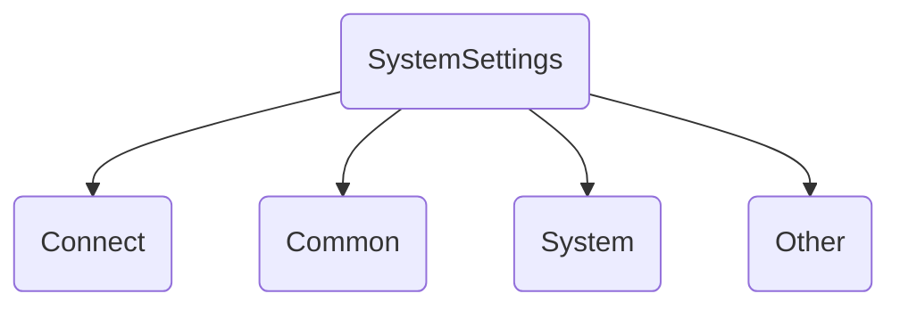

系统实现描述

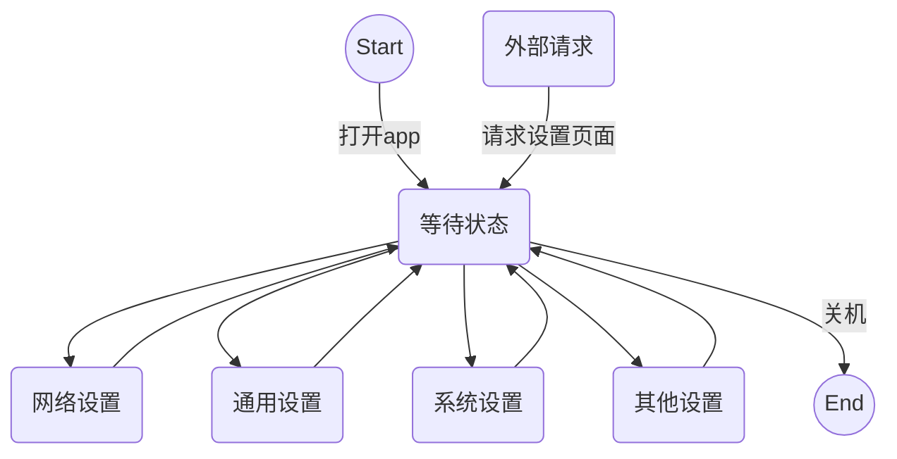

MVP架构

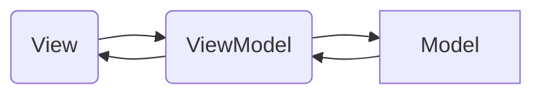

MVP架构的系统设置

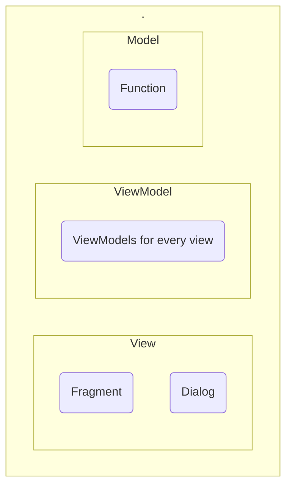

Fragment类图

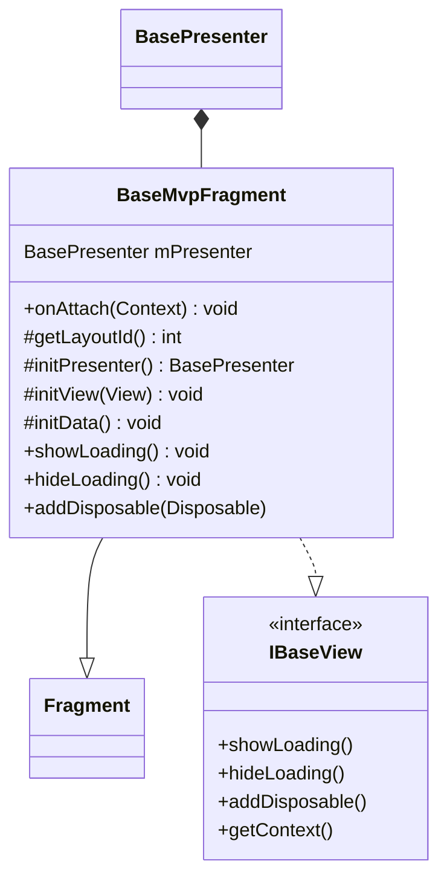

activity类图

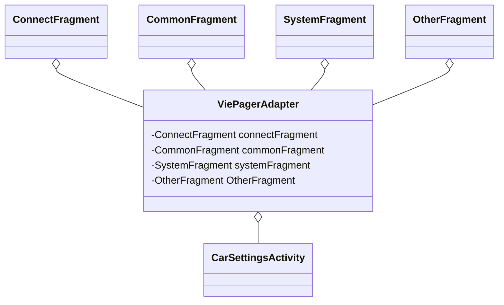

activity时序图

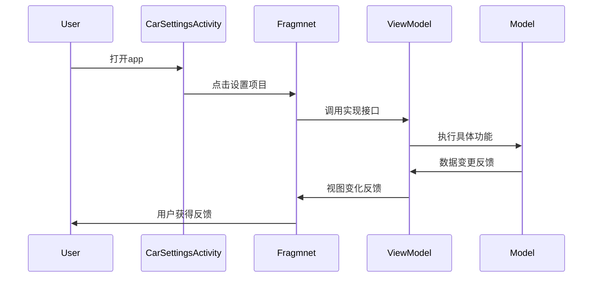

dialog类图

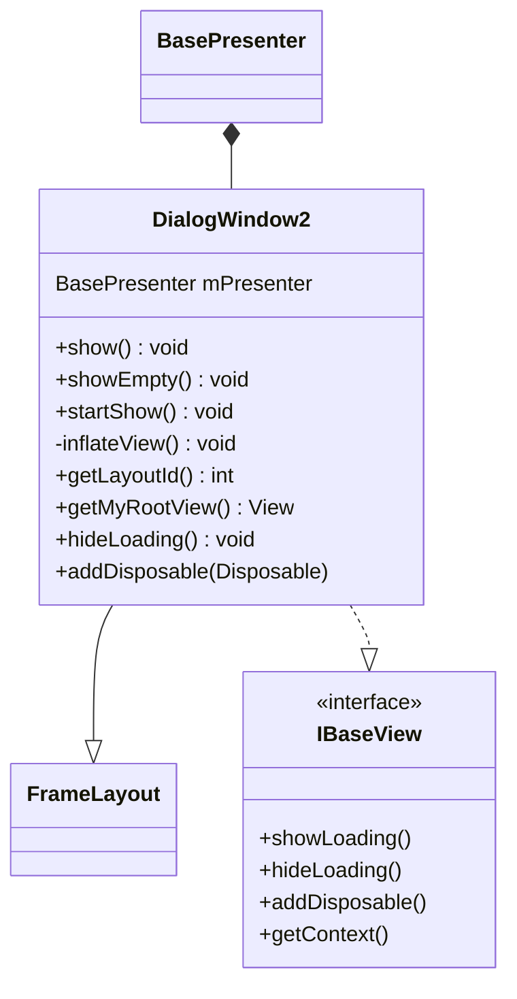

connect Fragment

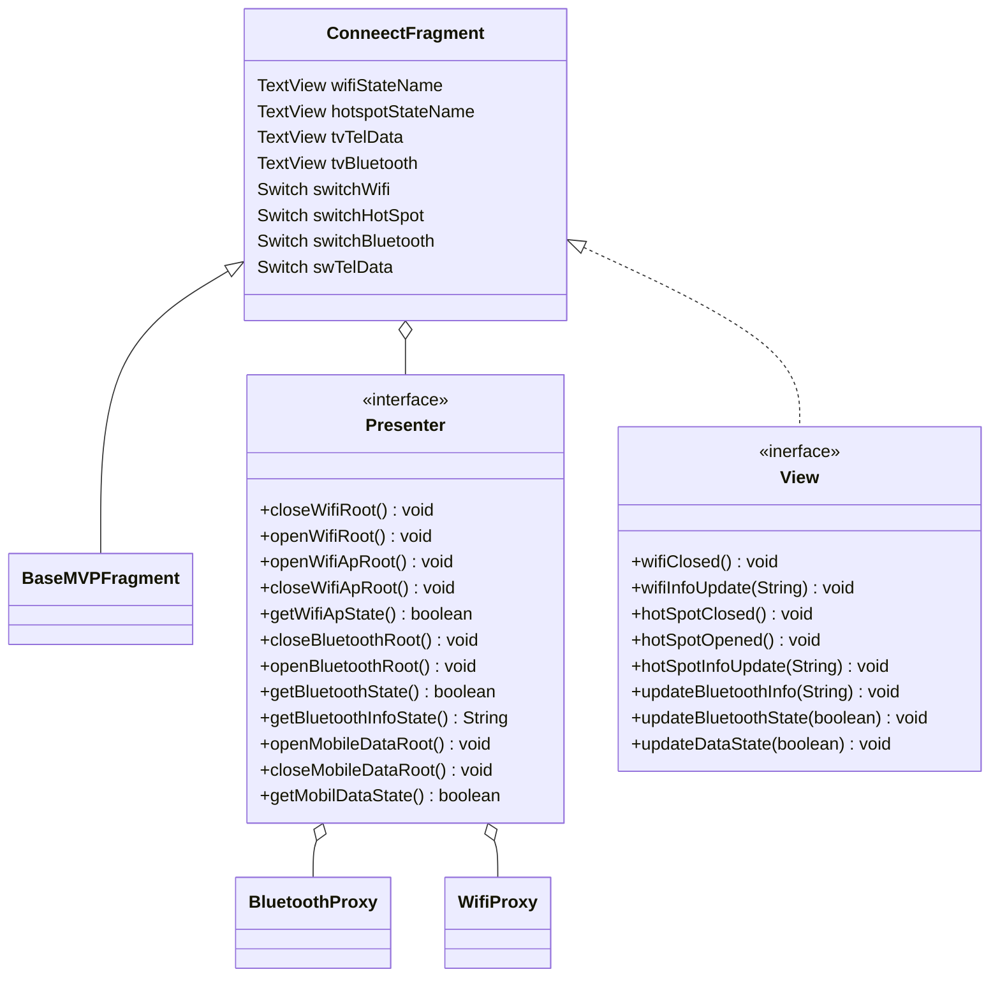

connect Presenter
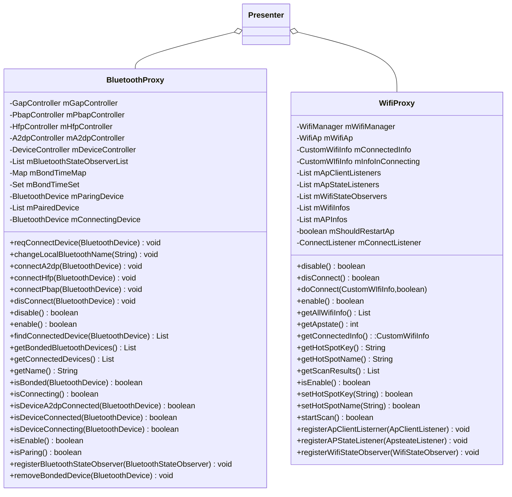

WifiWindow

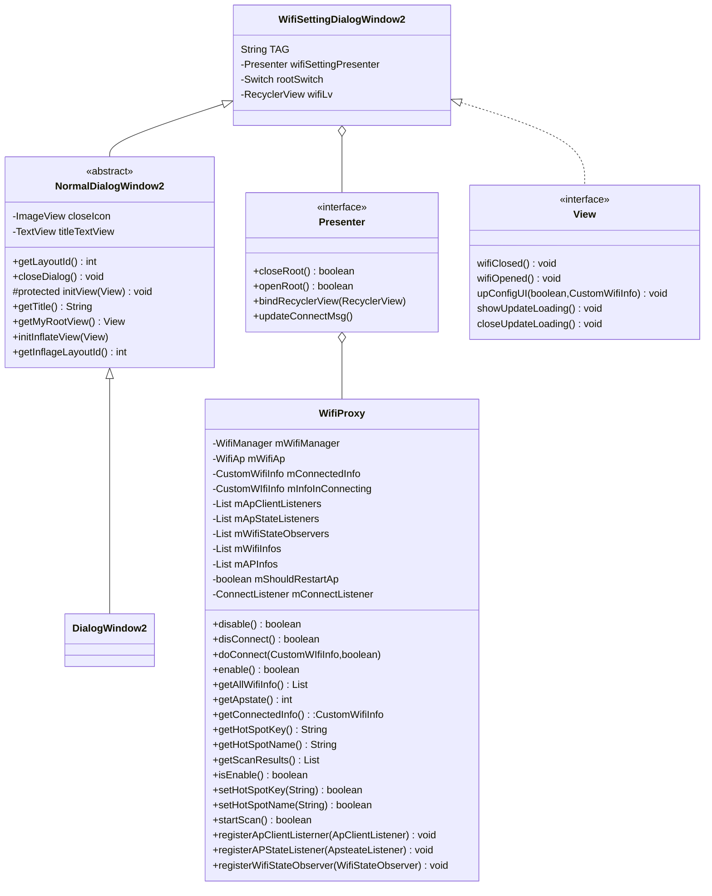

BluetoothWindow

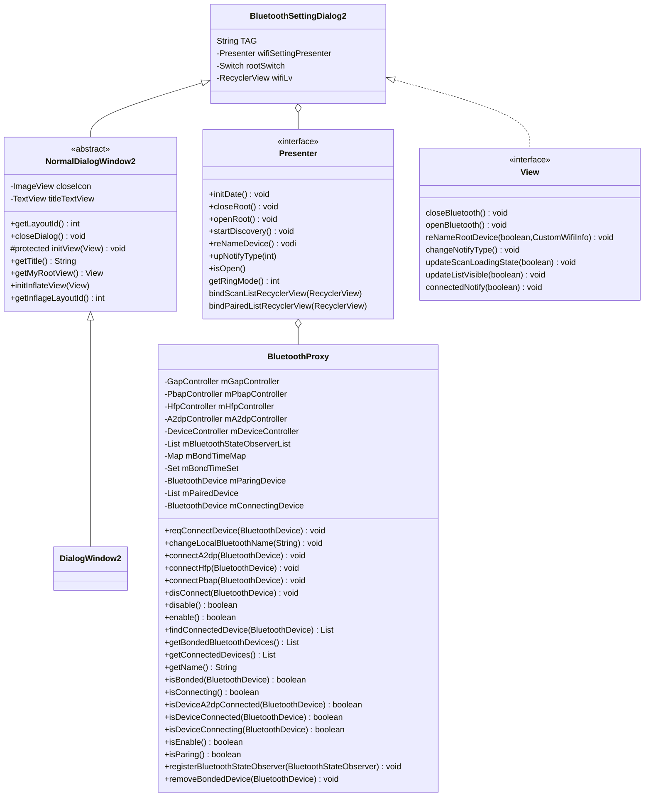

hotspot类图
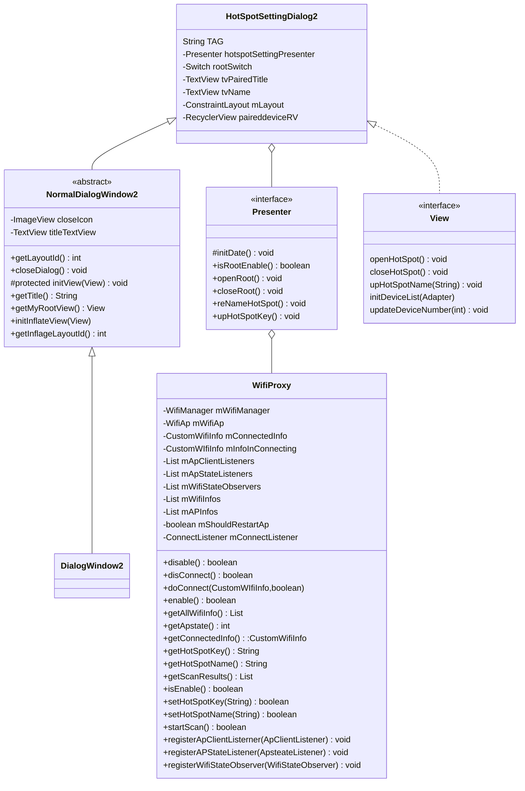

wifi开关时序图
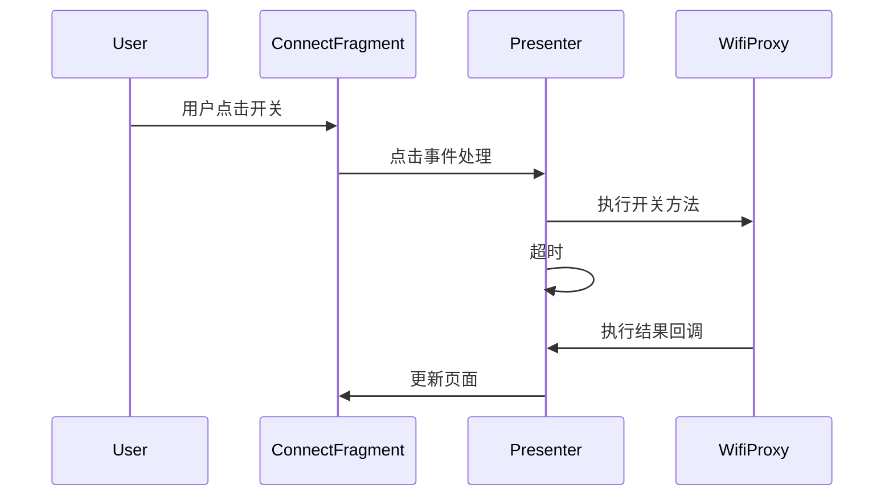
wifi连接时序图
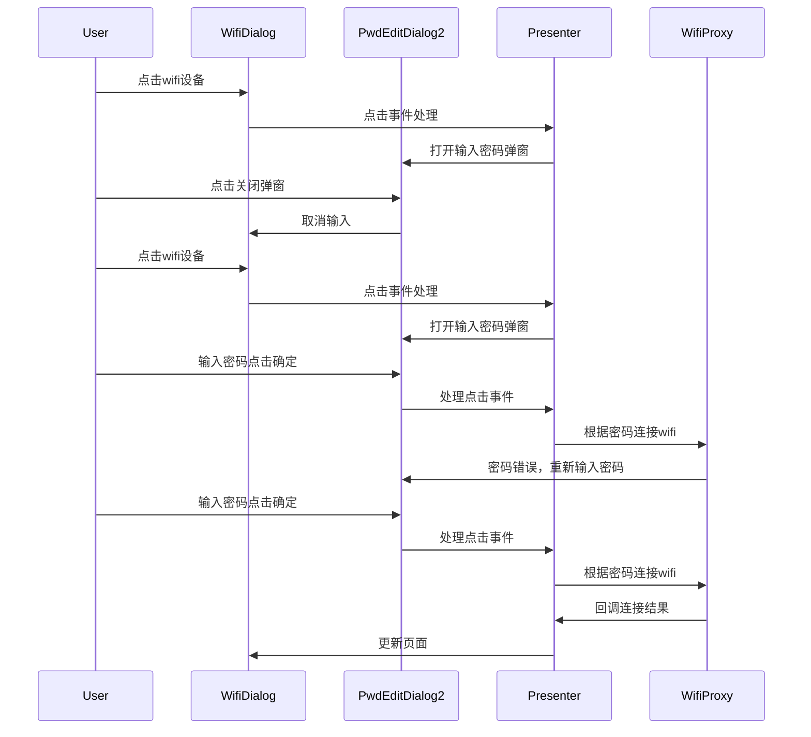
蓝牙配对时序图