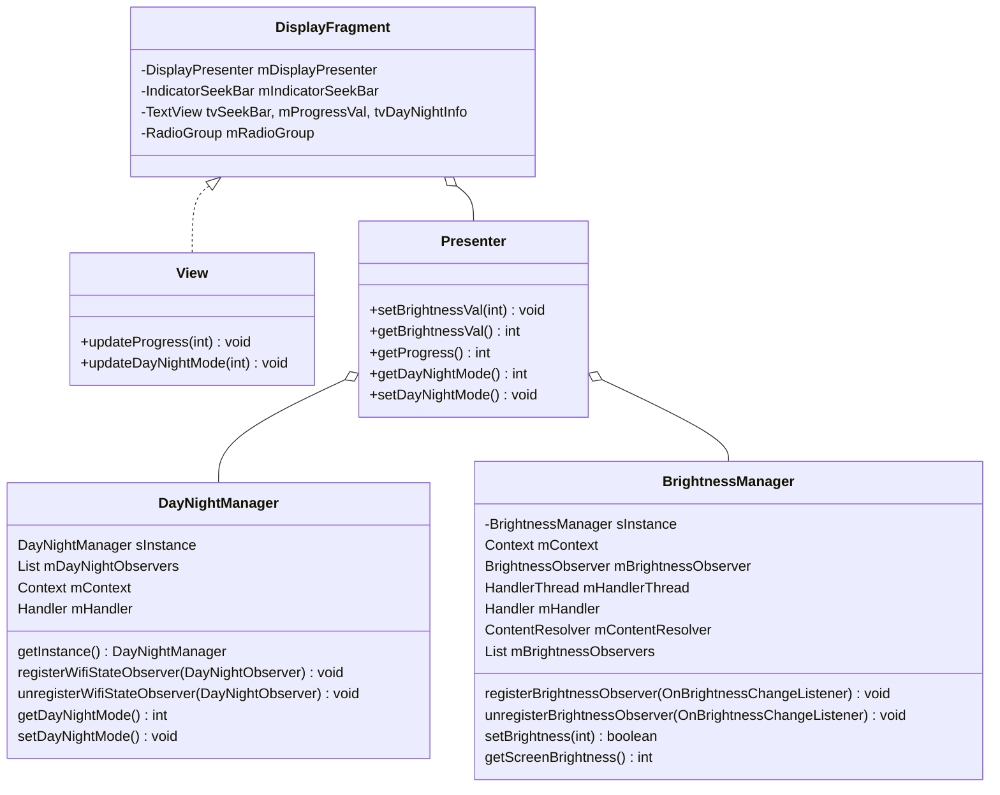
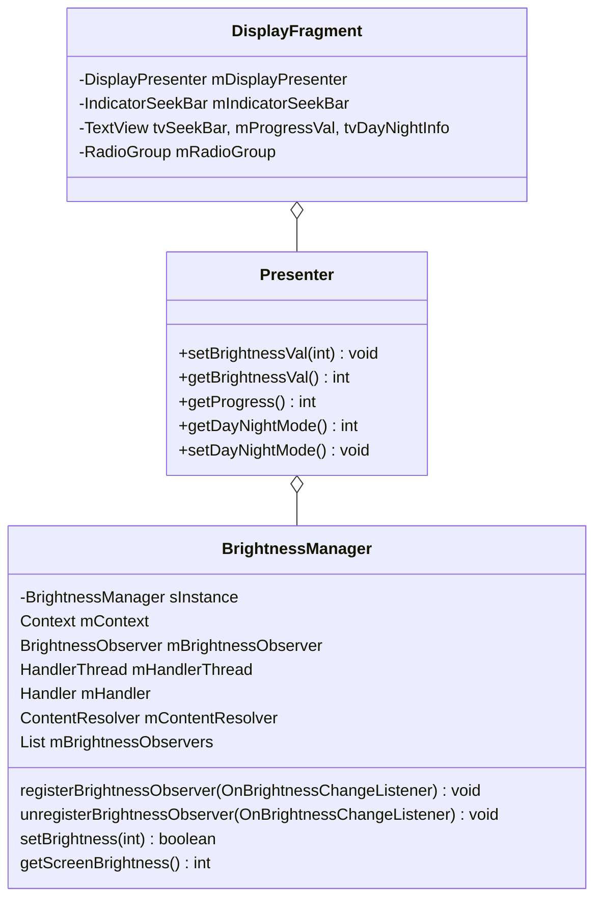

亮度管理类

```mermaid
classDiagram
class DisplayFragment{
 -DisplayPresenter mDisplayPresenter
 -IndicatorSeekBar mIndicatorSeekBar
 -TextView tvSeekBar, mProgressVal, tvDayNightInfo
 -RadioGroup mRadioGroup
}
class View{
	+updateProgress(int)void
	+updateDayNightMode(int)void
}
class Presenter{
 +setBrightnessVal(int)void
 +getBrightnessVal()int
 +getProgress()int
 +getDayNightMode()int
 +setDayNightMode()void
}
class BrightnessManager{
 -BrightnessManager sInstance
Context mContext
BrightnessObserver mBrightnessObserver
HandlerThread mHandlerThread
Handler mHandler
ContentResolver mContentResolver
List<OnBrightnessChangeListener> mBrightnessObservers
registerBrightnessObserver(OnBrightnessChangeListener)void
unregisterBrightnessObserver(OnBrightnessChangeListener)void
setBrightness(int)boolean
getScreenBrightness()int
}
class DayNightManager{
DayNightManager sInstance
List<DayNightObserver> mDayNightObservers
Context mContext
Handler mHandler
getInstance()DayNightManager
registerWifiStateObserver(DayNightObserver)void
unregisterWifiStateObserver(DayNightObserver)void
getDayNightMode()int
setDayNightMode()void
}
DisplayFragment <|..View
DisplayFragment o-- Presenter
Presenter o-- DayNightManager
Presenter o-- BrightnessManager
```

```mermaid
classDiagram
class DisplayFragment{
 -DisplayPresenter mDisplayPresenter
 -IndicatorSeekBar mIndicatorSeekBar
 -TextView tvSeekBar, mProgressVal, tvDayNightInfo
 -RadioGroup mRadioGroup
}
class Presenter{
 +setBrightnessVal(int)void
 +getBrightnessVal()int
 +getProgress()int
 +getDayNightMode()int
 +setDayNightMode()void
}
class BrightnessManager{
 -BrightnessManager sInstance
Context mContext
BrightnessObserver mBrightnessObserver
HandlerThread mHandlerThread
Handler mHandler
ContentResolver mContentResolver
List<OnBrightnessChangeListener> mBrightnessObservers
registerBrightnessObserver(OnBrightnessChangeListener)void
unregisterBrightnessObserver(OnBrightnessChangeListener)void
setBrightness(int)boolean
getScreenBrightness()int
}
DisplayFragment o-- Presenter
Presenter o-- BrightnessManager
```