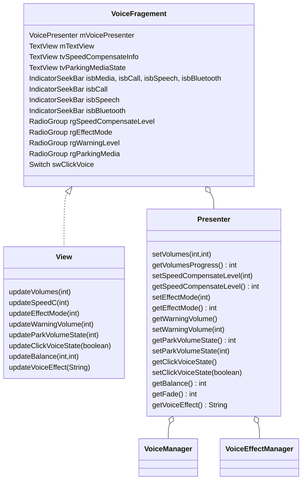
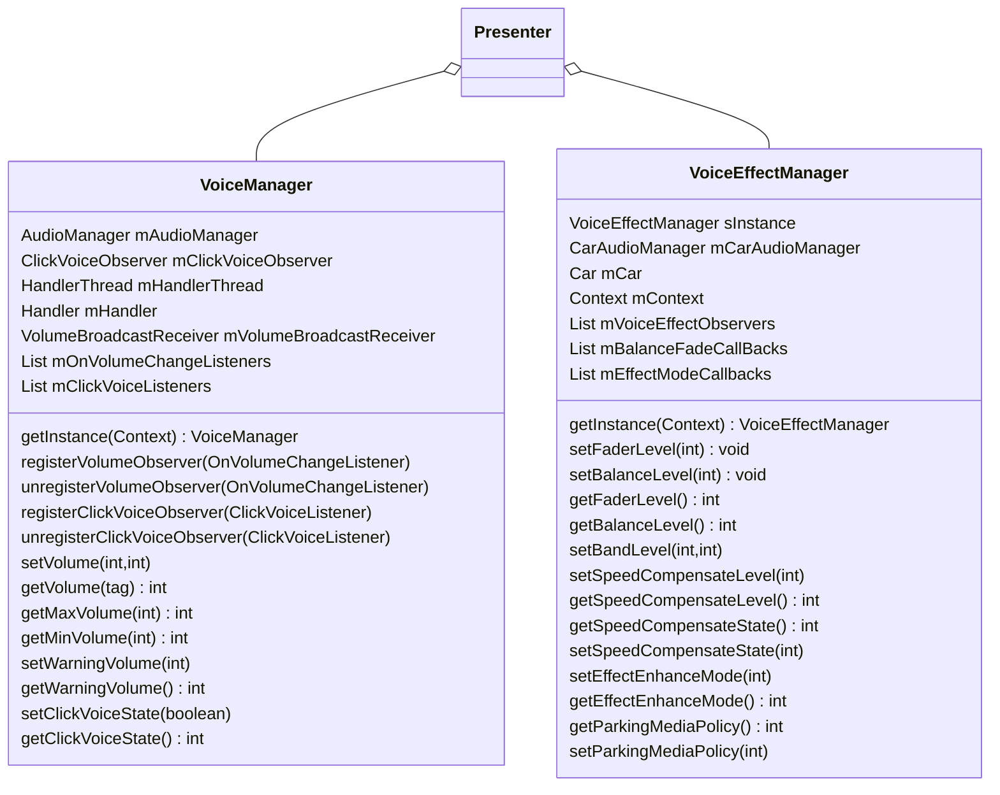
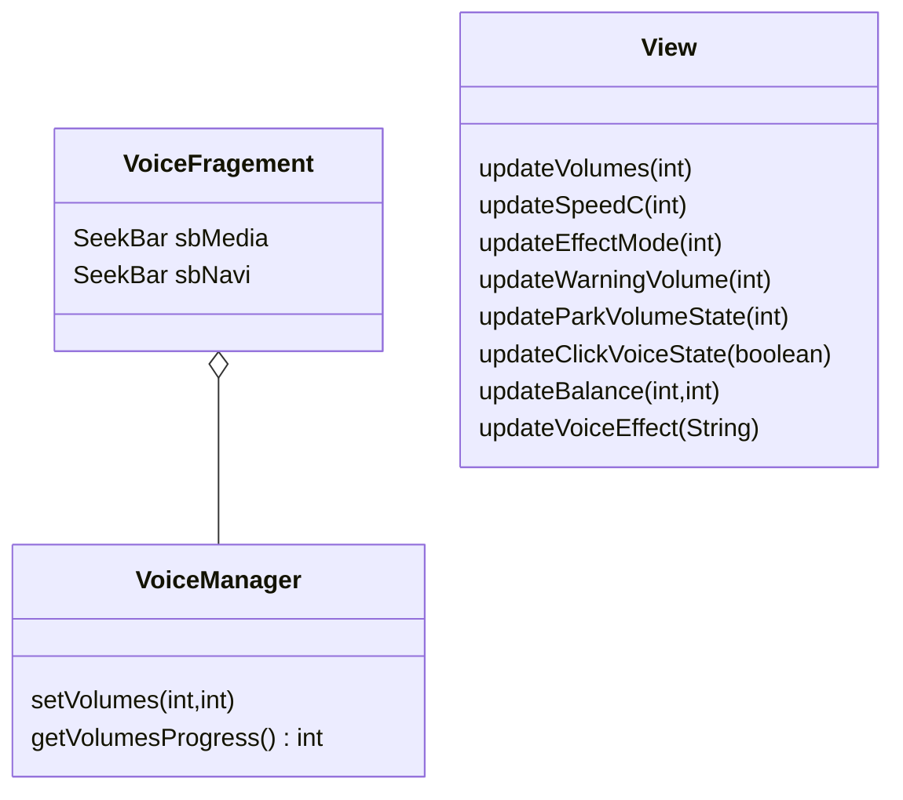

```mermaid
classDiagram
class VoiceFragement{
 VoicePresenter mVoicePresenter
 TextView mTextView
 TextView tvSpeedCompensateInfo
 TextView tvParkingMediaState
 IndicatorSeekBar isbMedia, isbCall, isbSpeech, isbBluetooth
 IndicatorSeekBar isbCall
  IndicatorSeekBar isbSpeech
  IndicatorSeekBar isbBluetooth
RadioGroup rgSpeedCompensateLevel
RadioGroup rgEffectMode
RadioGroup rgWarningLevel
RadioGroup rgParkingMedia
Switch swClickVoice
}
class View{
	updateVolumes(int)
	updateSpeedC(int)
	updateEffectMode(int)
	updateWarningVolume(int)
	updateParkVolumeState(int)
	updateClickVoiceState(boolean)
	updateBalance(int,int)
	updateVoiceEffect(String)
}
class Presenter{
 setVolumes(int,int)
 getVolumesProgress()int
 setSpeedCompensateLevel(int)
 getSpeedCompensateLevel()int
 setEffectMode(int)
 getEffectMode()int
 getWarningVolume()
 setWarningVolume(int)
 getParkVolumeState()int
 setParkVolumeState(int)
 getClickVoiceState()
 setClickVoiceState(boolean)
 getBalance()int
 getFade()int
 getVoiceEffect()String
}

VoiceFragement <|..View
VoiceFragement o-- Presenter
Presenter o-- VoiceManager
Presenter o-- VoiceEffectManager
```

```mermaid
classDiagram
class VoiceManager{
AudioManager mAudioManager
ClickVoiceObserver mClickVoiceObserver
HandlerThread mHandlerThread
Handler mHandler
VolumeBroadcastReceiver mVolumeBroadcastReceiver
List<OnVolumeChangeListener> mOnVolumeChangeListeners
List<ClickVoiceListener> mClickVoiceListeners

getInstance(Context)VoiceManager
 registerVolumeObserver(OnVolumeChangeListener)
 unregisterVolumeObserver(OnVolumeChangeListener)
 registerClickVoiceObserver(ClickVoiceListener)
 unregisterClickVoiceObserver(ClickVoiceListener)
 setVolume(int,int)
 getVolume(tag)int
 getMaxVolume(int)int
 getMinVolume(int)int
 setWarningVolume(int)
 getWarningVolume()int
 setClickVoiceState(boolean)
 getClickVoiceState()int
}
class VoiceEffectManager{
 VoiceEffectManager sInstance
 CarAudioManager mCarAudioManager
 Car mCar
 Context mContext
 List<VoiceEffectObserver> mVoiceEffectObservers
 List<BalanceFadeCallBack> mBalanceFadeCallBacks
 List<EffectModeCallback> mEffectModeCallbacks
 getInstance(Context)VoiceEffectManager
 setFaderLevel(int)void
 setBalanceLevel(int)void
 getFaderLevel()int
 getBalanceLevel()int
 setBandLevel(int,int)
 setSpeedCompensateLevel(int)
 getSpeedCompensateLevel()int
 getSpeedCompensateState()int
 setSpeedCompensateState(int)
 setEffectEnhanceMode(int)
 getEffectEnhanceMode()int
 getParkingMediaPolicy()int
 setParkingMediaPolicy(int)
}
Presenter o-- VoiceManager
Presenter o-- VoiceEffectManager
```
106

```mermaid
classDiagram
class VoiceFragement{
 SeekBar sbMedia
 SeekBar sbNavi

}
class View{
	updateVolumes(int)
	updateSpeedC(int)
	updateEffectMode(int)
	updateWarningVolume(int)
	updateParkVolumeState(int)
	updateClickVoiceState(boolean)
	updateBalance(int,int)
	updateVoiceEffect(String)
}
class VoiceManager{
 setVolumes(int,int)
 getVolumesProgress()int
}

VoiceFragement o-- VoiceManager
```
