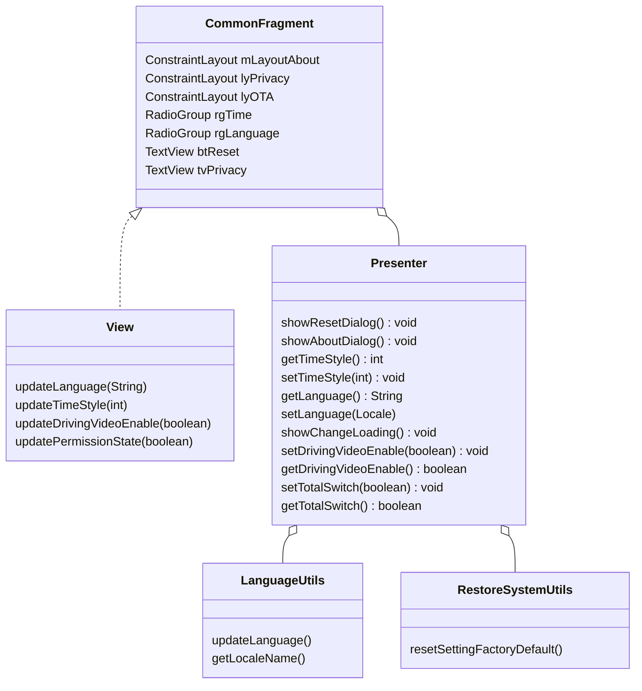

```mermaid
classDiagram
class View{
  updateLanguage(String)
 updateTimeStyle(int)
 updateDrivingVideoEnable(boolean)
 updatePermissionState(boolean)
}
class Presenter{
showResetDialog()void
showAboutDialog()void
getTimeStyle()int 
setTimeStyle(int)void 
getLanguage()String 
setLanguage(Locale)
showChangeLoading()void
setDrivingVideoEnable(boolean)void
getDrivingVideoEnable()boolean
setTotalSwitch(boolean)void
getTotalSwitch()boolean 
}
class CommonFragment{
 ConstraintLayout mLayoutAbout
 ConstraintLayout lyPrivacy
 ConstraintLayout lyOTA
 RadioGroup rgTime
 RadioGroup rgLanguage
 TextView btReset
 TextView tvPrivacy 
}
class LanguageUtils{
 updateLanguage()
 getLocaleName()
}
class RestoreSystemUtils{
 resetSettingFactoryDefault()
}
CommonFragment <|..View
CommonFragment o-- Presenter
Presenter o-- LanguageUtils
Presenter o-- RestoreSystemUtils
```