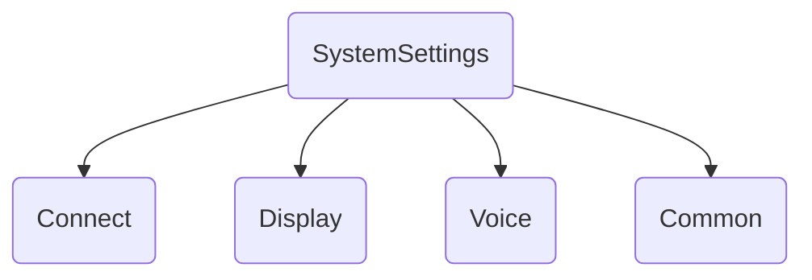
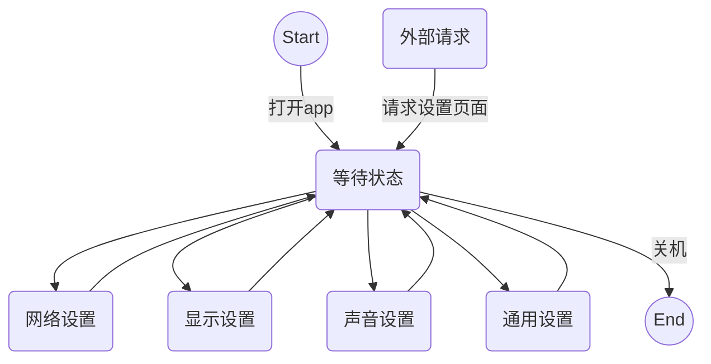
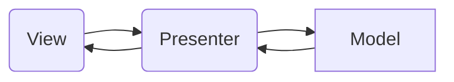
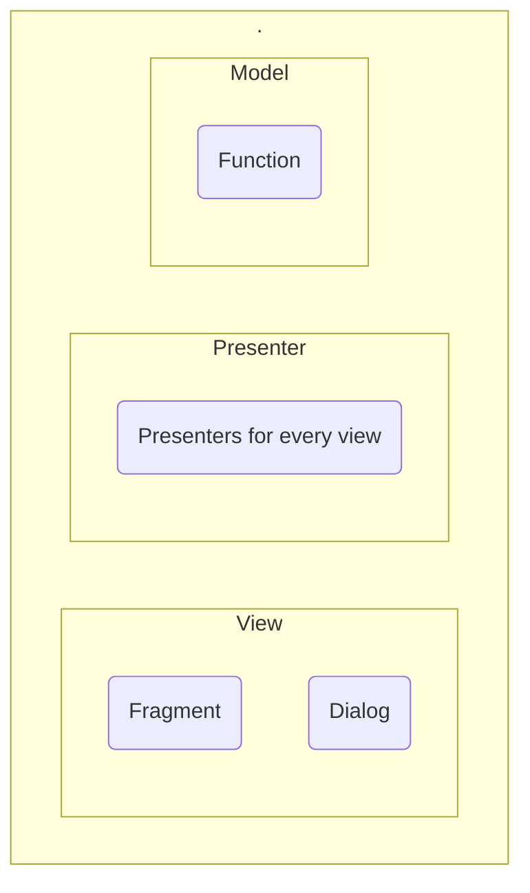
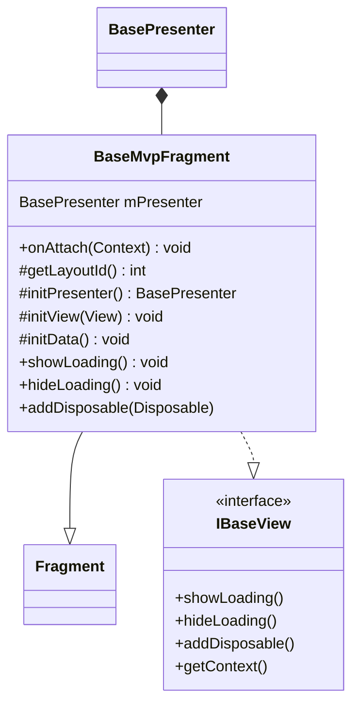
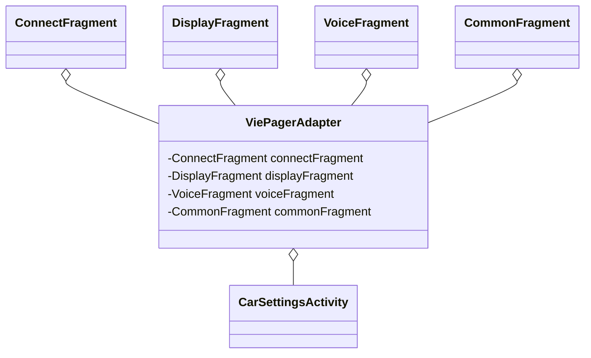
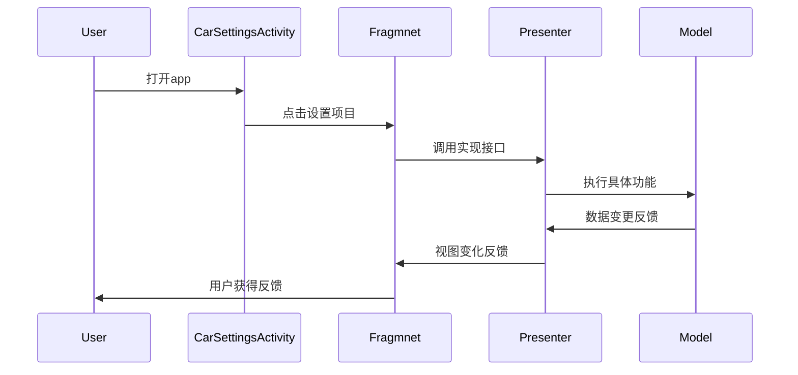
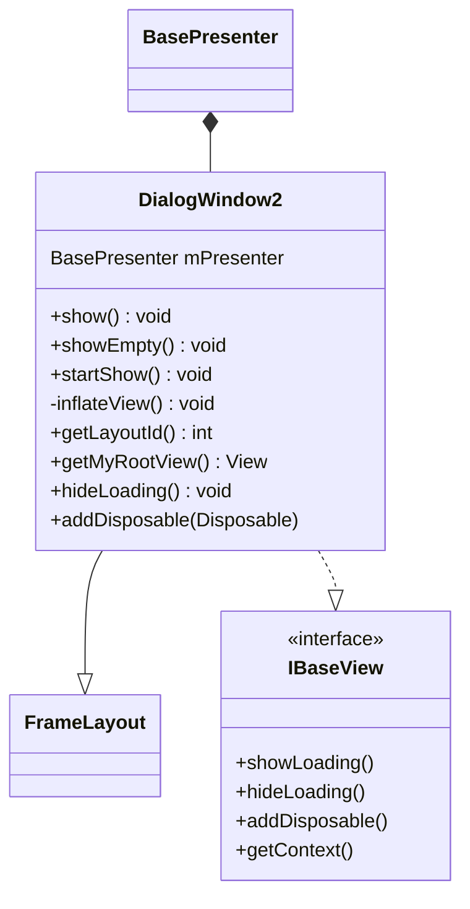
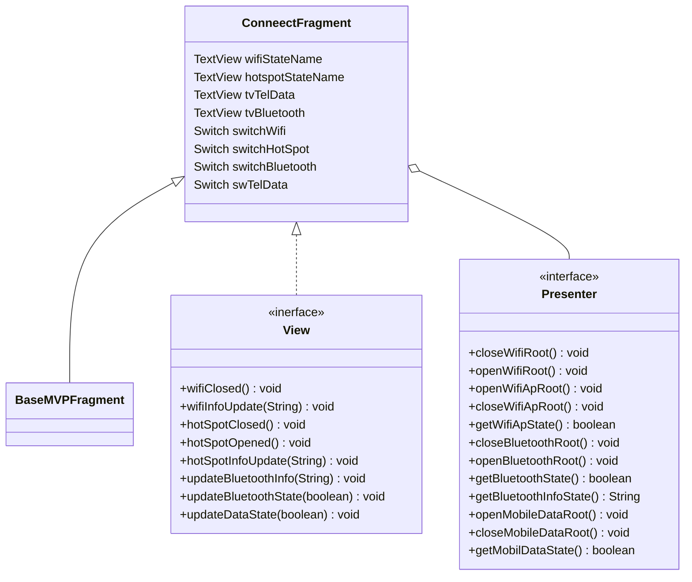

系统结构描述

```mermaid
graph TB
System(SystemSettings) --> Connect(Connect)
System --> Display(Display)
System --> Voice(Voice)
System --> Common(Common)
```

系统实现描述

```mermaid
graph TB
Start((Start)) -->|打开app| Hold(等待状态)
Interrupt(外部请求) -->|请求设置页面|Hold
Hold -->Connect(网络设置)
Hold -->Display(显示设置)
Hold -->Voice(声音设置)
Hold -->Common(通用设置)
Connect -->Hold
Display -->Hold
Voice -->Hold
Common -->Hold
Hold -->|关机|End((End))
```
MVP架构

```mermaid
graph LR
View(View) -->Presenter(Presenter)
Presenter -->Model
Presenter -->View
Model-->Presenter
```

MVP架构的系统设置

```mermaid
graph 

subgraph .
subgraph View
    Fragment(Fragment)
    Dialog(Dialog)
end
subgraph Presenter
    Presenters(Presenters for every view)
end
subgraph Model
    Models(Function)
    end


end
```
Fragment类图

```mermaid
classDiagram
class Fragment
BaseMvpFragment --|> Fragment
class BaseMvpFragment{
 BasePresenter mPresenter
 +onAttach(Context)void
 #getLayoutId()int
 #initPresenter()BasePresenter
 #initView(View)void
 #initData()void
 +showLoading()void
 +hideLoading()void
 +addDisposable(Disposable)
}
class IBaseView{
<<interface>>
+showLoading()
+hideLoading()
+addDisposable()
+getContext()
}
BaseMvpFragment ..|> IBaseView
class BasePresenter{ 
}
BasePresenter *-- BaseMvpFragment

```
activity类图

```mermaid
classDiagram
class CarSettingsActivity{
	
}
class ViePagerAdapter{
-ConnectFragment connectFragment
-DisplayFragment displayFragment
-VoiceFragment voiceFragment
-CommonFragment commonFragment
}
class ConnectFragment
ConnectFragment o-- ViePagerAdapter
class DisplayFragment
DisplayFragment o-- ViePagerAdapter
class VoiceFragment
VoiceFragment o-- ViePagerAdapter
class CommonFragment
CommonFragment o-- ViePagerAdapter
ViePagerAdapter o-- CarSettingsActivity
```
activity时序图

```mermaid
sequenceDiagram
participant User
participant CarSettingsActivity
participant Fragmnet
participant Presenter
participant Model
User->>CarSettingsActivity:打开app
CarSettingsActivity->>Fragmnet:点击设置项目
Fragmnet->>Presenter:调用实现接口
Presenter->>Model:执行具体功能
Model->>Presenter:数据变更反馈
Presenter->>Fragmnet:视图变化反馈
Fragmnet->>User:用户获得反馈
```

dialog类图

```mermaid
classDiagram
class FrameLayout
DialogWindow2 --|> FrameLayout
class DialogWindow2{
 BasePresenter mPresenter
 +show()void
 +showEmpty()void
 +startShow()void
 -inflateView()void
 +getLayoutId()int
 +getMyRootView()View
 +hideLoading()void
 +addDisposable(Disposable)
}
class IBaseView{
<<interface>>
+showLoading()
+hideLoading()
+addDisposable()
+getContext()
}
DialogWindow2 ..|> IBaseView
class BasePresenter{ 
}
BasePresenter *-- DialogWindow2

```

connectfragment

```mermaid
classDiagram
class ConneectFragment{
TextView wifiStateName
TextView hotspotStateName
TextView tvTelData
TextView tvBluetooth
Switch switchWifi
Switch switchHotSpot
Switch switchBluetooth
Switch swTelData
}
class BaseMVPFragment
class Presenter{
<<interface>>
 +closeWifiRoot()void
 +openWifiRoot()void
 +openWifiApRoot()void
 +closeWifiApRoot()void
 +getWifiApState()boolean
 +closeBluetoothRoot()void
 +openBluetoothRoot()void
 +getBluetoothState()boolean
 +getBluetoothInfoState()String
 +openMobileDataRoot()void
 +closeMobileDataRoot()void
 +getMobilDataState()boolean
}
class View{
	<<inerface>>
	+wifiClosed()void
	+wifiInfoUpdate(String)void
	+hotSpotClosed()void
	+hotSpotOpened()void
	+hotSpotInfoUpdate(String)void
	+updateBluetoothInfo(String)void
	+updateBluetoothState(boolean)void
	+updateDataState(boolean)void
}
ConneectFragment <|-- BaseMVPFragment
ConneectFragment <|.. View
ConneectFragment o-- Presenter

```
