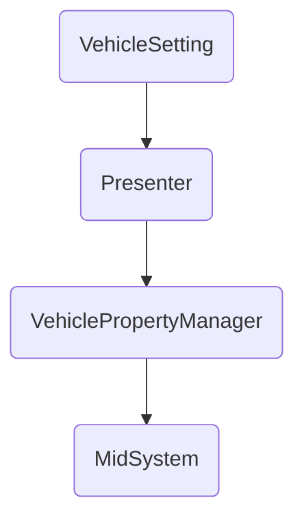
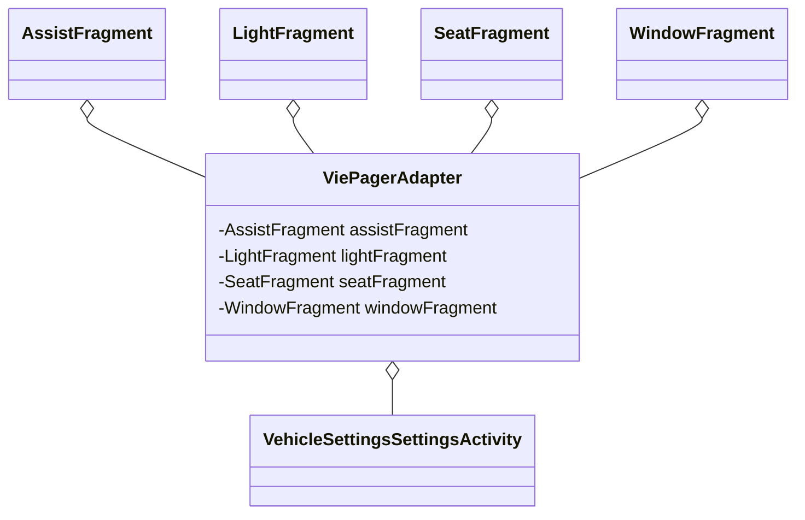
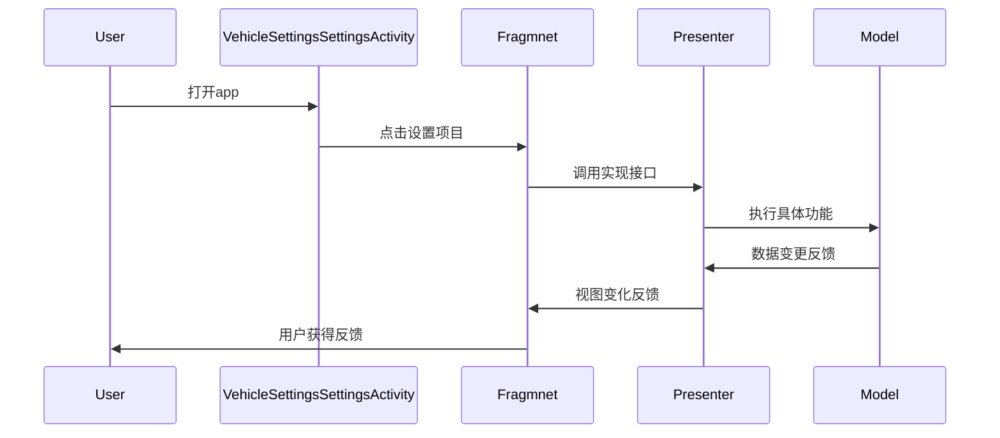
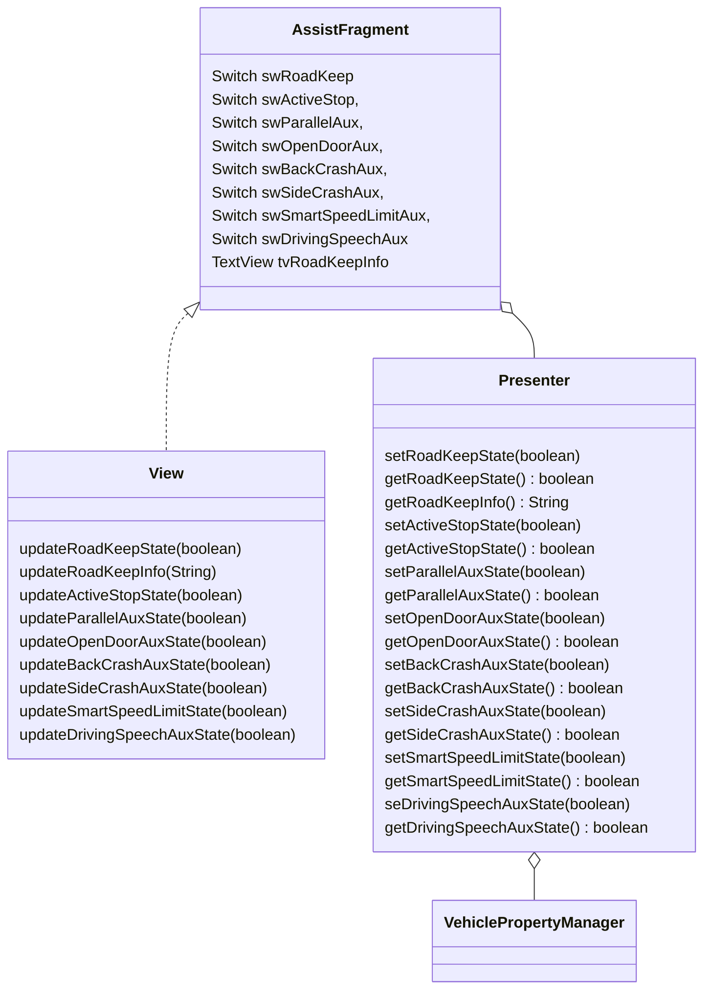
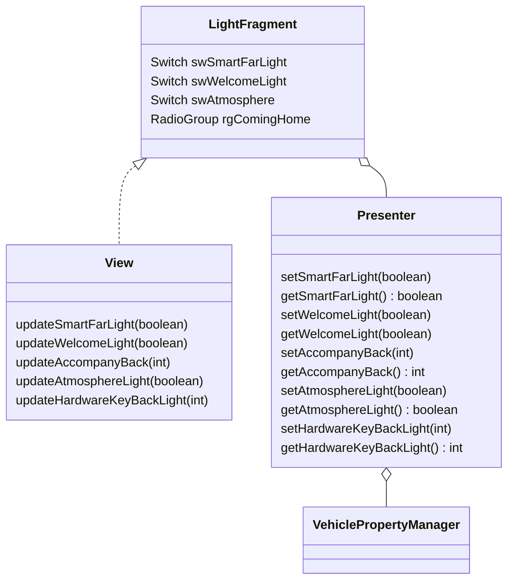
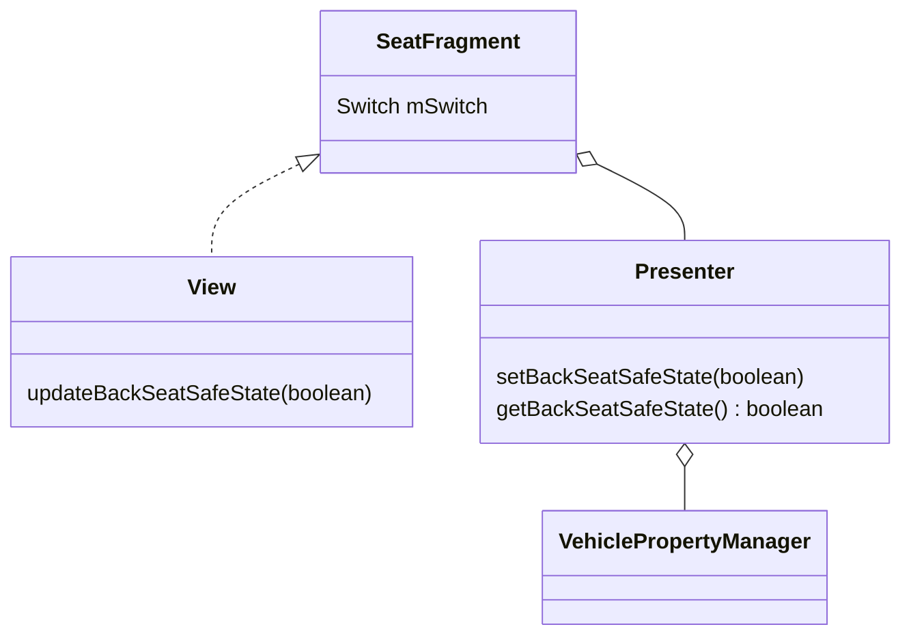
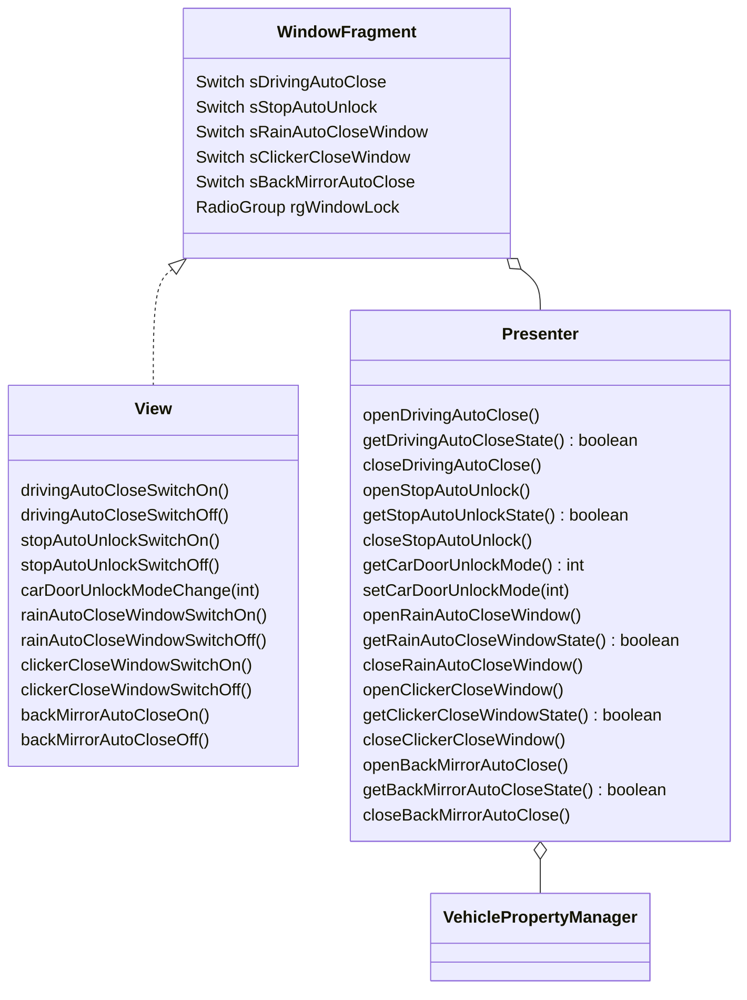

车辆设置

```mermaid
graph TB
VehicleSetting(VehicleSetting) --> Presenter(Presenter)
Presenter --> VehiclePropertyManager(VehiclePropertyManager)
VehiclePropertyManager --> MidSystem(MidSystem)
```

```mermaid
classDiagram
class VehicleSettingsSettingsActivity{
    
}
class ViePagerAdapter{
-AssistFragment assistFragment
-LightFragment lightFragment
-SeatFragment seatFragment
-WindowFragment windowFragment
}
class AssistFragment
AssistFragment o-- ViePagerAdapter
class LightFragment
LightFragment o-- ViePagerAdapter
class SeatFragment
SeatFragment o-- ViePagerAdapter
class WindowFragment
WindowFragment o-- ViePagerAdapter
ViePagerAdapter o-- VehicleSettingsSettingsActivity

```

```mermaid
sequenceDiagram
participant User
participant VehicleSettingsSettingsActivity
participant Fragmnet
participant Presenter
participant Model
User->>VehicleSettingsSettingsActivity:打开app
VehicleSettingsSettingsActivity->>Fragmnet:点击设置项目
Fragmnet->>Presenter:调用实现接口
Presenter->>Model:执行具体功能
Model->>Presenter:数据变更反馈
Presenter->>Fragmnet:视图变化反馈
Fragmnet->>User:用户获得反馈

```

```mermaid
classDiagram
class AssistFragment{
 Switch swRoadKeep
Switch swActiveStop,
Switch swParallelAux,
Switch swOpenDoorAux,
Switch swBackCrashAux,
Switch swSideCrashAux,
Switch swSmartSpeedLimitAux,
Switch swDrivingSpeechAux
TextView tvRoadKeepInfo
}
class View{
 updateRoadKeepState(boolean)
 updateRoadKeepInfo(String)
 updateActiveStopState(boolean)
 updateParallelAuxState(boolean)
 updateOpenDoorAuxState(boolean)
 updateBackCrashAuxState(boolean)
 updateSideCrashAuxState(boolean)
 updateSmartSpeedLimitState(boolean)
 updateDrivingSpeechAuxState(boolean)
}
class Presenter{
 setRoadKeepState(boolean)
 getRoadKeepState()boolean
 getRoadKeepInfo()String
 setActiveStopState(boolean)
 getActiveStopState()boolean
 setParallelAuxState(boolean)
 getParallelAuxState()boolean
 setOpenDoorAuxState(boolean)
 getOpenDoorAuxState()boolean
 setBackCrashAuxState(boolean)
 getBackCrashAuxState()boolean
 setSideCrashAuxState(boolean)
 getSideCrashAuxState()boolean
 setSmartSpeedLimitState(boolean)
 getSmartSpeedLimitState()boolean
 seDrivingSpeechAuxState(boolean)
 getDrivingSpeechAuxState()boolean
}
AssistFragment <|..View
AssistFragment o-- Presenter
Presenter o-- VehiclePropertyManager
```

```mermaid
classDiagram
class LightFragment{
 Switch swSmartFarLight
Switch swWelcomeLight
Switch swAtmosphere
RadioGroup rgComingHome

}
class View{
 updateSmartFarLight(boolean)
 updateWelcomeLight(boolean)
 updateAccompanyBack(int)
 updateAtmosphereLight(boolean)
 updateHardwareKeyBackLight(int)
 }
class Presenter{
 setSmartFarLight(boolean)
 getSmartFarLight()boolean
 setWelcomeLight(boolean)
 getWelcomeLight(boolean)
 setAccompanyBack(int)
 getAccompanyBack()int
 setAtmosphereLight(boolean)
 getAtmosphereLight()boolean
 setHardwareKeyBackLight(int)
 getHardwareKeyBackLight()int
}
LightFragment <|..View
LightFragment o-- Presenter
Presenter o-- VehiclePropertyManager
```

```mermaid
classDiagram
class SeatFragment{
Switch mSwitch
}
class View{
 updateBackSeatSafeState(boolean)
 }
class Presenter{
 setBackSeatSafeState(boolean)
 getBackSeatSafeState()boolean
}
SeatFragment <|..View
SeatFragment o-- Presenter
Presenter o-- VehiclePropertyManager
```

```mermaid
classDiagram
class WindowFragment{
Switch sDrivingAutoClose
Switch sStopAutoUnlock
Switch sRainAutoCloseWindow
Switch sClickerCloseWindow
Switch sBackMirrorAutoClose
RadioGroup rgWindowLock
}
class View{
 drivingAutoCloseSwitchOn()
 drivingAutoCloseSwitchOff()
stopAutoUnlockSwitchOn()
stopAutoUnlockSwitchOff()
carDoorUnlockModeChange(int)
rainAutoCloseWindowSwitchOn()
rainAutoCloseWindowSwitchOff()
clickerCloseWindowSwitchOn()
clickerCloseWindowSwitchOff()
backMirrorAutoCloseOn()
backMirrorAutoCloseOff()
 }
class Presenter{
 openDrivingAutoClose()
 getDrivingAutoCloseState()boolean
 closeDrivingAutoClose()
 openStopAutoUnlock()
 getStopAutoUnlockState()boolean
 closeStopAutoUnlock()
 getCarDoorUnlockMode()int
 setCarDoorUnlockMode(int)
 openRainAutoCloseWindow()
 getRainAutoCloseWindowState()boolean
 closeRainAutoCloseWindow()
 openClickerCloseWindow()
 getClickerCloseWindowState()boolean
 closeClickerCloseWindow()
 openBackMirrorAutoClose()
 getBackMirrorAutoCloseState()boolean
 closeBackMirrorAutoClose()
}
WindowFragment <|..View
WindowFragment o-- Presenter
Presenter o-- VehiclePropertyManager
```