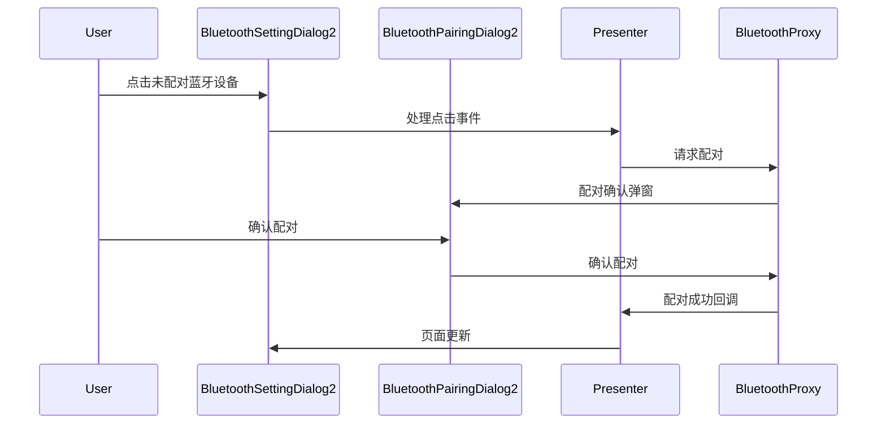
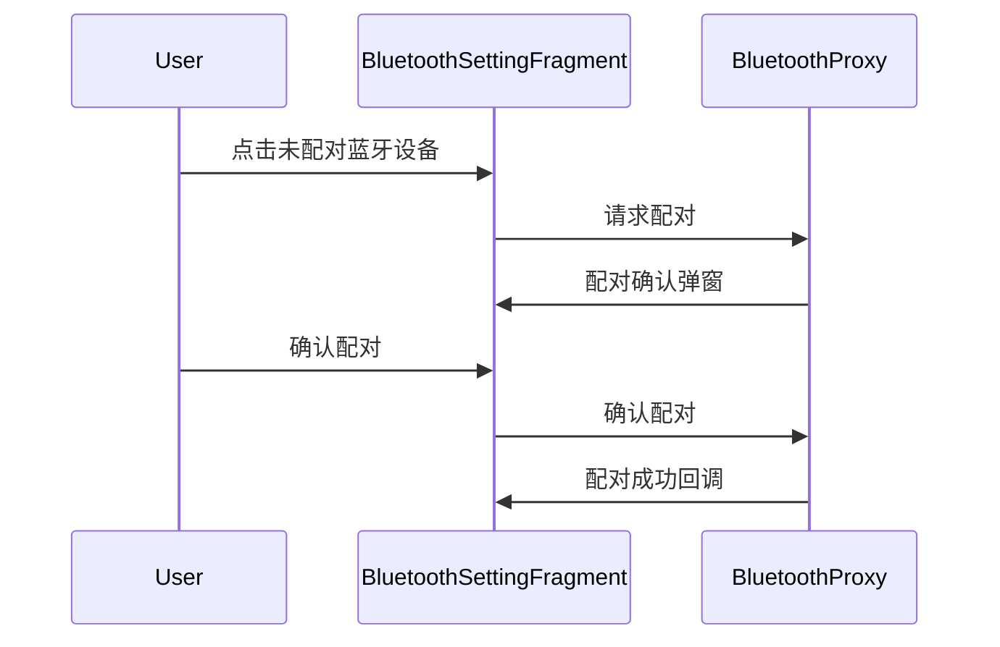

蓝牙配对时序图

```mermaid
sequenceDiagram
participant User
participant BluetoothSettingDialog2
participant BluetoothPairingDialog2
participant Presenter
participant BluetoothProxy
User ->> BluetoothSettingDialog2:点击未配对蓝牙设备
BluetoothSettingDialog2 ->> Presenter: 处理点击事件
Presenter ->> BluetoothProxy:请求配对
BluetoothProxy ->>  BluetoothPairingDialog2:配对确认弹窗
User ->> BluetoothPairingDialog2:确认配对
BluetoothPairingDialog2 ->> BluetoothProxy:确认配对
BluetoothProxy ->> Presenter:配对成功回调
Presenter ->> BluetoothSettingDialog2:页面更新
```

```mermaid
sequenceDiagram
participant User
participant BluetoothSettingFragment
participant BluetoothProxy
participant BluetoothProxy
User ->> BluetoothSettingFragment:点击未配对蓝牙设备
BluetoothSettingFragment ->> BluetoothProxy:请求配对
BluetoothProxy ->>  BluetoothSettingFragment:配对确认弹窗
User ->> BluetoothSettingFragment:确认配对
BluetoothSettingFragment ->> BluetoothProxy:确认配对
BluetoothProxy ->> BluetoothSettingFragment:配对成功回调
```