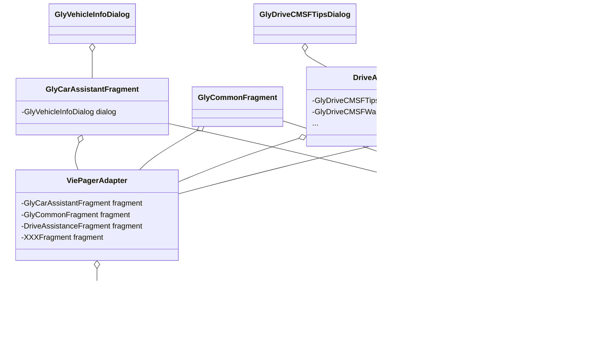

```mermaid
classDiagram
class GlySettingsActivity{
    -GlySettingsMenuAdapter mMenuAdapter
    -GlyFragmentAdapter mFragmentAdapter
}
class ViePagerAdapter{
-GlyCarAssistantFragment fragment
-GlyCommonFragment fragment
-DriveAssistanceFragment fragment
-XXXFragment fragment
}
class GlyBaseFragment
class GlyCarAssistantFragment{
 -GlyVehicleInfoDialog dialog
}
class GlyVehicleInfoDialog
GlyVehicleInfoDialog o-- GlyCarAssistantFragment
GlyCarAssistantFragment o-- ViePagerAdapter
class GlyCommonFragment
GlyCommonFragment o-- ViePagerAdapter
class DriveAssistanceFragment{
 -GlyDriveCMSFTipsDialog dialog 
 -GlyDriveCMSFWarnTipsDialog dialog 
 ...
}
class GlyDriveCMSFTipsDialog
GlyDriveCMSFTipsDialog o-- DriveAssistanceFragment
class GlyDriveCMSFWarnTipsDialog
GlyDriveCMSFWarnTipsDialog o-- DriveAssistanceFragment
DriveAssistanceFragment o-- ViePagerAdapter
class XXXFragment
XXXFragment o-- ViePagerAdapter
GlyCarAssistantFragment --> GlyBaseFragment
GlyCommonFragment --> GlyBaseFragment
DriveAssistanceFragment --> GlyBaseFragment
XXXFragment --> GlyBaseFragment
ViePagerAdapter o-- GlySettingsActivity
```