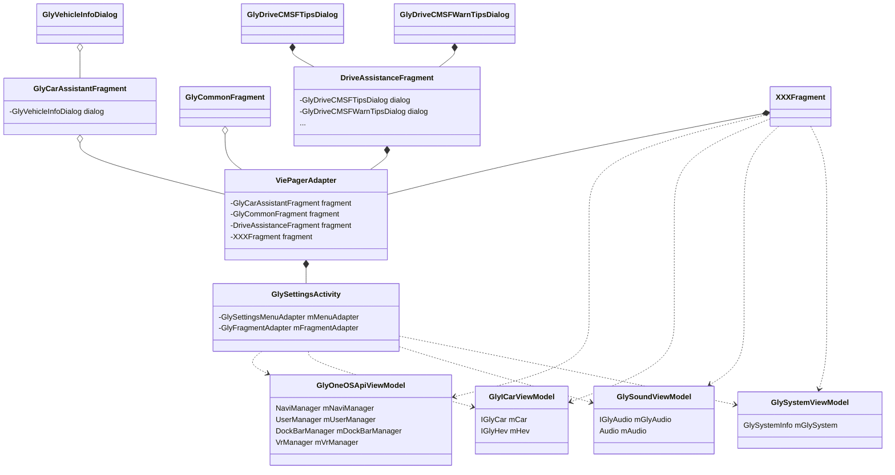
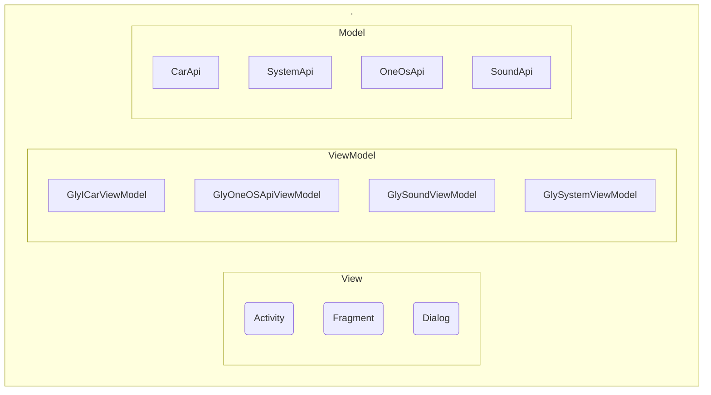

GlyCarAssistantFragment --> GlyBaseFragment
GlyCommonFragment --> GlyBaseFragment
DriveAssistanceFragment --> GlyBaseFragment
XXXFragment --> GlyBaseFragment

GlyCarAssistantFragment ..> GlyOneOSApiViewModel
GlyCarAssistantFragment ..> GlyICarViewModel
GlyCarAssistantFragment ..> GlySoundViewModel
GlyCarAssistantFragment ..> GlySystemViewModel

GlyCommonFragment ..> GlyOneOSApiViewModel
GlyCommonFragment ..> GlyICarViewModel
GlyCommonFragment ..> GlySoundViewModel
GlyCommonFragment ..> GlySystemViewModel

DriveAssistanceFragment ..> GlyOneOSApiViewModel
DriveAssistanceFragment ..> GlyICarViewModel
DriveAssistanceFragment ..> GlySoundViewModel
DriveAssistanceFragment ..> GlySystemViewModel

