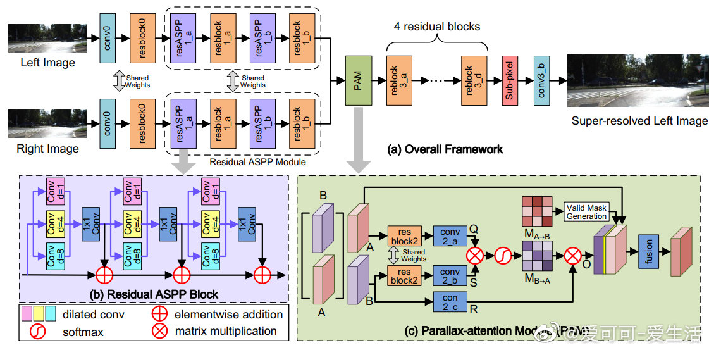

[爱可可-爱生活](http://weibo.com/1402400261)
05/29/2019

* * *

几篇论文实现代码：

《Learning Context Graph for Person Search》(CVPR 2019 Oral) GitHub:http://t.cn/AiKYP3k2

《Generating Classification Weights with GNN Denoising Autoencoders for Few-Shot Learning》(CVPR 2019) GitHub:http://t.cn/AiKYP3kv

《Learning Parallax Attention for Stereo Image Super-Resolution》(CVPR 2019) GitHub:http://t.cn/AiKYP3DY

《Non-Monotonic Sequential Text Generation》(ICML 2019) GitHub:http://t.cn/AiKYP3kA

《Federated Online Learning to Rank with Evolution Strategies》(WSDM 2019) GitHub:http://t.cn/AiKYP3D1

《A Modular Benchmarking Infrastructure for High-Performance and Reproducible Deep Learning》GitHub:http://t.cn/AiKYP3DQ

《Panoptic Feature Pyramid Networks》GitHub:http://t.cn/AiKYP3kP

《Gated Context Aggregation Network for Image Dehazing and Deraining》GitHub:http://t.cn/AiKYP3kh

《Exploration via flow-based intrinsic Rewards》GitHub:http://t.cn/AiKYP3DT
《Can GCNs Go as Deep as CNNs?》GitHub:http://t.cn/AiKjmwBI

《Combination of Multiple Global Descriptors for Image Retrieval》GitHub:http://t.cn/AiKYP3DH

《Intrinsic Multi-scale Evaluation of Generative Models》GitHub:http://t.cn/AiKYP3k7

《CutMix: Regularization Strategy to Train Strong Classifiers with Localizable Features》GitHub:http://t.cn/AiKYP3Du

《LightNet++: Boosted Light-weighted Networks for Real-time Semantic Segmentation》GitHub:http://t.cn/AiKYP3kL

《Exploration by Random Network Distillation》GitHub:http://t.cn/AiKYP3De

《3D RoI-aware U-Net for Accurate and Efficient Colorectal Cancer Segmentation》GitHub:http://t.cn/AiKYP3D3

《Unsupervised Cross-dataset Person Re-identification by Transfer Learning of Spatio-temporal Patterns》GitHub:http://t.cn/RnSf9WM

《Making Deep Neural Networks Robust to Label Noise: a Loss Correction Approach》GitHub:http://t.cn/AiKYP3DB

《Fast and Efficient Skinning of Animated Meshes》GitHub:http://t.cn/AiKYP3Dm

《Ordered Neurons: Integrating Tree Structures into Recurrent Neural Networks》GitHub:http://t.cn/AiKYP3kw

[查看源微博](http://weibo.com/1402400261/HwsAk0Fxl)