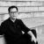
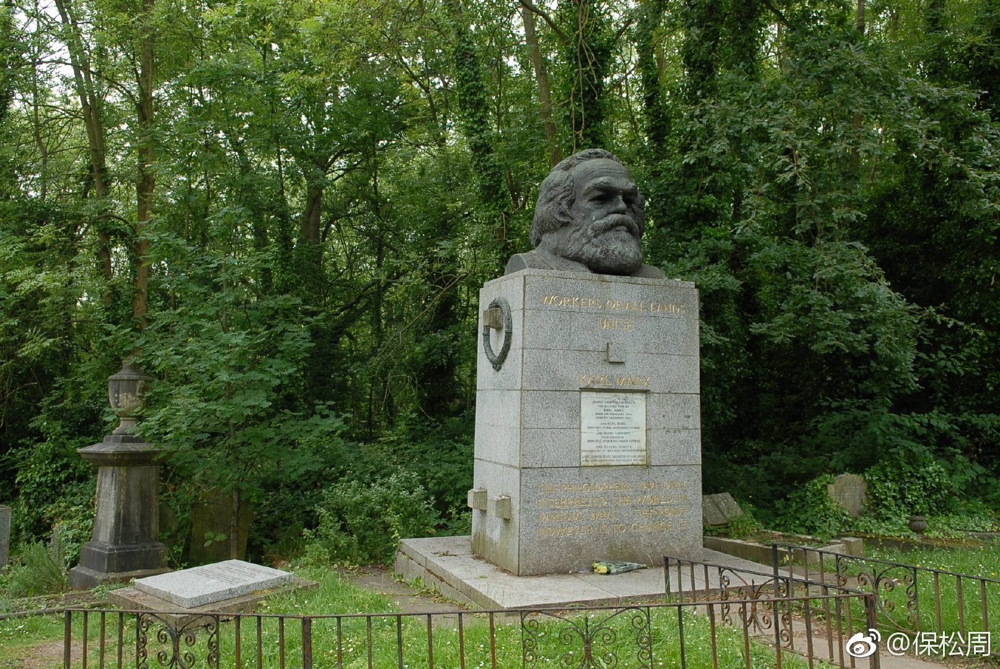
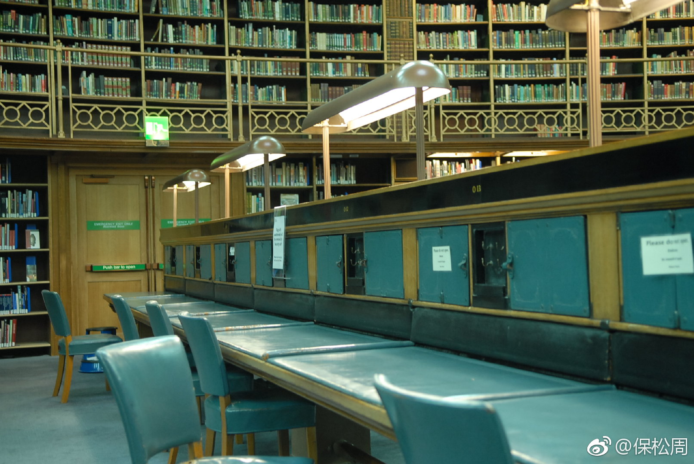

[保松周](http://weibo.com/6762444823)
01/06/2019

* * *

反思馬克思
周保松

1996年完成论文后，已是初秋，我抱着忐忑的心情，从约克南下，去伦敦经济及政治学院找我后来的老师硕维（John Charvet）教授。

政治系在King’s Chamber，一幢古老的三层红砖建筑，楼梯窄得只够一个人走。我爬上三楼，初会我的老师。硕维教授穿着西服，温文随和，说话慢条斯理，典型的英国绅士。

我说，我想研究伯林（Isaiah Berlin）和罗尔斯，主题是多元主义和自由主义。这个题目并不新鲜，因为行内谁都知道多元主义对这两位哲学家的影响。但我当时已很困惑于这样的问题：如果价值有不同来源，公民有多元信仰，如何证成一组合理的政治原则？这组原则为什么是自由主义，而不是别的理论？

硕维同意我的研究方向，並说伯林是他六十年代在牛津时的指导老师。他又告诉我，当时整个英国几乎没人在意政治哲学，牛津甚至没有政治哲学这一门课。直到《正义论》出版，情况才改变过来。

那天下午，我们谈得很愉快。临走，硕维说，他乐意指导我。退出老师的办公室，我松了口气，终于有心情逛逛这所著名学府。我先去哲学系参观，见到波柏（Karl Popper）的铜像放在走廊一角，一脸肃穆。然后去了经济系，但却找不到哈耶克的影子。我见天色尚早，突然有去探访马克思的念头。

马克思葬在伦敦北部的Highgate Cemetery，离市中心不太远，但我却坐错了车，待去到墓园，已是黄昏，四周静寂，只见形态各异的墓碑，在柔弱晚照中默然而立。马克思在墓园深处，墓碑上立着他的头像，样子威严，眼神深邃。墓身上方写着「全世界工人团结起来」，下方写着「哲学家们只是用不同的方式解释世界，而问题在于改变世界」──这是《关于费尔巴哈的提纲》的最后一条，写于1845年。

马克思的斜对面，低调地躺着另一位曾经叱咤一时的哲学家史宾塞（Hebert Spencer, 1820-1903）。史宾塞的墓很小，如果不留心，很难发现。史宾塞是社会进化论者，当年读完达尔文的《物种起源》后，第一个提出「适者生存」（survival of the fittest）的概念，对留学英国的严复影响甚深。 严复后来将赫胥黎（Thomas Huxley）的《天演论》和史宾塞的《群学肄言》译成中文，并主张「物竞天择，适者生存」，影响无数中国知识分子。

百年后，浪花淘尽英雄，我这样一个中国青年，孑然一身立于两位哲人中间，回首来时那条丛林掩影的曲径，真有「逝者如斯夫，不舍昼夜」之叹。

马克思是我认识的第一位哲学家。早在八十年代中移民香港前，已在国内初中政治课听过他的名字。我甚至记得，当年曾认真地问过老师，共产主义真的会来吗？老师说，一定的，这是历史发展的必然规律。我不知所以然，但老师既说得那么肯定，我遂深信不疑，开始数算二零零零年实现四个现代化后，离共产社会还有多远。

当天站在马克思墓前，少年梦想早已远去，真正震撼我的，是看到墓碑上那句对哲学家的嘲讽。难道不是吗？如果哲学家只是在书斋里空谈理论，对改变世界毫无作用，那么我决心以政治哲学为志业，所为何事？这对踌躇满志的我，有如棒喝。

马克思的观点，表面看似乎是这样：哲学家只懂得提出抽象的理论解释世界，却对改变世界毫无帮助。真正重要的，是推翻资本主义，消灭阶级对立，解放全人类。改变的力量，来自全世界的工人无产阶级。如果这是个全称命题，包括马克思在内，似乎没什么道理，因为马克思一生大部份时间都在从事理论工作。如果理论没用，那我们不用读他的《资本论》了。马克思也没理由说自己不是哲学家，他的博士论文写的是希腊哲学，而他的历史唯物主义更在解释人类发展的内在规律。

回到这句话的语境，马克思的观点应是：费尔巴哈和其他哲学家对哲学的理解出了问题。

问题出在哪里？

这要回到费尔巴哈的哲学观。费尔巴哈在《基督教的本质》中提出一个革命性的观点：人不是按神的形象而被创造，而是反过来，上帝是按人的形像而被创造，然后将其安放在外在超越的位置加以膜拜。上帝不是客观真实的存有，而是有限的个体将人性中最理想和最纯粹的特质（知识、能力和善心等），投射为完美上帝的理念，但自己却没有意识到这一事实。宗教异化由此而生，因为个体将本来属于人作为类存在（species-being）的本质误当为上帝的本质，并受其支配。哲学的任务，是透过概念分析，揭示这种虚假状态，恢复人类本真的自我意识，成为自由自主的人。

费尔巴哈明白表示：「我们的任务，便正在于证明，属神的东西跟属人的东西的对立，是一种虚幻的对立，它不过是人的本质跟人的个体之间的对立。」 由于宗教是所有虚假的源头，因此哲学对宗教的颠覆，是人类解放的必要条件。

马克思认同费尔巴哈的目标，却认为单凭哲学解释，根本不能建立一个自由平等的社群，因为导致异化的真正源头，并非人类缺乏哲学的明晰和清楚的自我意识，而是由资本主义的经济和社会结构造成。要克服异化，必须改变产生虚假意识的社会制度。再者，费尔巴哈或许以为单凭纯粹的哲学思辨，能为社会批判找到独立基础，但下层建筑决定上层建筑，如果不先改变经济结构，人们的宗观和哲学观根本难以超越时代限制。

单凭哲学解释不足以改变世界，这点我没有异议。但改变世界可以不需要哲学吗？我想，马克思本人也不会接受这点。

改变世界之前，我们須回答两个问题。

一，必须清楚当下的世界为何不义，否则不知道为何要革命。
二，必须明白革命后的世界为何理想，否则不知道革命是否值得。

这两个都是规范性问题。

对于第一个问题，我相信马克思会说，资本主义之所以不义，是因为阶级对立导致严重剥削，私产制和过度分工导致工人异化，意识形态导致人们活得不真实，自利主义导致社群生活无从建立等等。

对于第二个问题，马克思会说，共产主义社会是个没有阶级没有剥削没有异化，人人能够实现类存在的理想世界。由此可见，改变世界之前，马克思同样需要一套政治道德理论，并以此解释和批判世界。

马克思（及马克思主义者）如果不同意这个说法，可有两种回应。第一，科学社会主义不需要谈道德，因为根据辩证法和历史唯物论，随着人类生产力的提高，既有的资本主义生产关系必然阻碍生产力进一步发展，并使得资产阶级和无产阶级矛盾加剧，最后导致革命，将人类带进社会主义的历史新阶段。既然历史有客观的发展规律，不以个人意志为转移，那么根本没必要纠缠于没完没了的道德争论。哲学家要做的，是帮助无产阶级客观认识这个规律，激起他们的阶级意识，加速革命完成。

一世纪过去，社会主义的实验，翻天覆地，到了今天恐怕再没有人如此乐观地相信历史决定论。资本主义经历不少危机，但离末路尚远，而且也没有人肯定，末路最后必然是社会主义。即使是社会主义，也不见得那便是理想的历史终结。此外，二次大战后福利国家的发展，大大缓和阶级矛盾，中产阶级兴起，而工人阶级也没有明确的共同利益，促使他们联合起来颠覆既有制度。最后，社会主义作为一种理想社会的政治想象，无论在西方还是中国，吸引力已大减。

在这种革命目标受到质疑，革命动力难以凝聚的处境中，马克思主义或者广义的左翼传统，如果要继续对资本主义的批判，并希望通过批判吸引更多同路人，那么批判的基础应该是道德和政治哲学，而非历史唯物论。

第二种回应，则认为即使我们想谈道德，也不可能摆脱资本主义意识形态的控制来谈。马克思认为，不是主观意识决定人的存在，而是社会存在决定人的意识。社会存在的基础有赖总体生产关系决定的经济结构，这个基础决定了法律、政治、宗教和道德这些上层建筑，并限定了人们看世界的方式。 因此，资本主义社会中控制生产工具的资本家，为了一己利益，总会千方百计将他们的价值观灌输给被统治者，并让他们相信资产阶级的利益就是他们的利益。在这种情况下，如果不先改变经济制度，任何真正的道德批判都不可能。

我不接受这种经济决定论。 无可否认，人的思考必然受限于他所处的社会和历史条件，但人的反省意识和价值意识，却使人有能力对这些条件本身作出批判。

面对当下的制度和观念，我们总可以问：「这样的制度真的合理吗？我们非得用这些观念来理解自身和世界吗？我们有理由接受这样的社会分配吗？」

原则上，理性反省没有疆界。这是人之所以为自由存有的基本意涵。如果否定这一点，我们无法解释，为什么青年马克思能够写出〈论犹太人问题〉和〈经济及哲学手稿〉这些批判资本主义的经典之作。我们也不能说，只有像马克思这样的先知，恰巧站在历史那一点，才使他能够超越虚假意识，洞察真相。如果真是那样，在资本主义兴旺发展的今天，左翼岂非更难找到社会批判的立足点？

所以，回到马克思那句话，我宁愿改为：哲学家们以不同的方式解释世界，问题是哪种解释才是合理的。这里的「解释」，涵盖了理解、证成和批判。这是政治哲学责无旁贷的工作。政治哲学既要对现实世界和人类生存处境有正确认识，同时要证成合理的社会政治原则，并以此作为社会改革的方向。

就此而言，理论和实践并非二分，更非对立，而是彼此互动。理论思考的过程，即在打破主流意识形态对人的支配，扩充我们对道德和政治生活的想象，并为社会批判提供基础。

一旦将马克思视为政治哲学家，我们遂可以将他的观点和其他理论互作对照。让我们以社会财富分配为例，在〈哥达纲领批判〉（1875）这篇经典文章中，马克思罕有地谈及日后共产社会的分配问题。在共产主义初级阶段，由于尚未完全摆脱资本主义的烙印，分配原则是按劳分配，即根据生产过程中付出的劳动力多寡决定个人所得，劳动成果应该全部归于劳动者。这体现了某种平等权利，因为它用了一个相同标准去衡量和分配所得。马克思却认为，这正是按劳分配的缺陷，因为它忽略了其他方面的道德考量。例如人在体力和智力上的差异，必然导致劳动力不平等。生产力高的人，收入一定远较老弱伤残者高。

此外，这个原则也没有考虑到每个人社会背景的差异。对结了婚或家有孩子的工人来说，即使付出和别人相同的劳力，拿到一样工资，实际上并不平等，因为他的家庭负担重得多。所以，接劳分配并不是合理的社会分配原则。

马克思声称，「为避免所有这些缺点，本来平等的权利必须改为不平等。」 那么该如何改呢？我们期待他提出更合理的建议。谁知去到这里，马克思笔锋一转，声称这些缺点在共产社会初级阶段是不可避免的，因为分配原则永远不能超越社会的经济结构和文化发展。只有去到共产社会更高阶段，生产力的高度发展彻底解决资源匮乏问题，劳动不再只是维生的手段，而是生命的主要欲望后，我们才能够完全克服「谁有权应得多少」这类资本主义社会残存的问题，并最终实现「各尽所能，各取所需」。

对于马克思的答案，我们可以提出两个质疑。

第一，马克思並没有告诉我们，在共产主义未实现之前，怎样的财富分配是合理公正的。他只以一个历史发展的许诺安慰活在当下的人，但这个许诺实在太遥远了。我们都知道，社会资源的分配，直接影响每个人的生命。我们能否实现自己的人生理想，能否享有幸福的家庭生活，能否得到别人的肯定和尊重，通通和我们在制度中可以配得多少资源息息相关。因此，作为平等公民，我们每个人都有正当的权利，要求一个公正的社会分配制度。

马克思或会说，非不欲也，实不能也，因为历史条件限制了所有可能性。为什么不能呢？今天許多民主國家福利社会，早已为公民提供各种社会保障，包括医疗、教育、房屋、失业和退休保障，以及对老弱病残者提供的特殊照料。当然，这些措施或许仍然不足，但不是远较按劳分配来得合理吗？

第二，马克思所许诺的共产主义社会，其实並没有处理到分配问题，而是将分配问题出现的环境消解了。分配问题之所以会出现，主要是由于社会资源适度不足以及参与生产合作的人对自己应得多少份额有不同诉求。但去到共产社会，生产力的进步令物质丰盛到能够使每个人得到全面发展，而生产者又不再视劳动本身为不得已的负担，因此分配问题根本不再存在。钱永祥先生因此认为：「在这个意义上，『各取所需』不再是分配原则，因为无限的资源加上『应得』概念的失去意义，已经没有『分配』这件事可言了。」

历史发展到今天，即使是最乐观的马克思主义者，也得承认地球资源有限，如果人类再以目前的模式消费下去，很快就要面对严重的环境和能源危机。既然资源无限的假设不切实际，社会正义问题便须认真面对。

圖1: 馬克思墓；圖2: 大英圖書館馬克思當年讀書處；圖3:倫敦政經學院政府系原址(King's Chamber）
*節錄於《行於所當行－－我的哲學之路》，收在《自由人的平等政治》（北京：三聯，2013)

[查看源微博](http://weibo.com/6762444823/HaJeFnU0q)