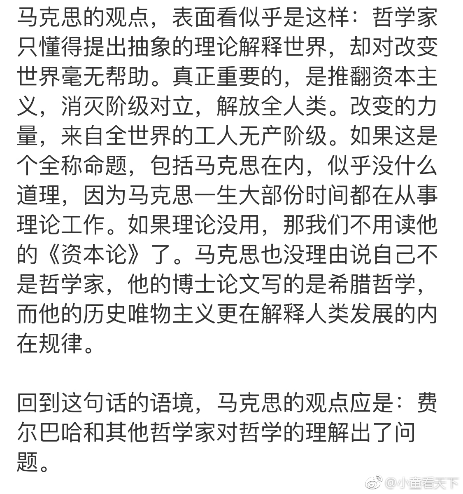
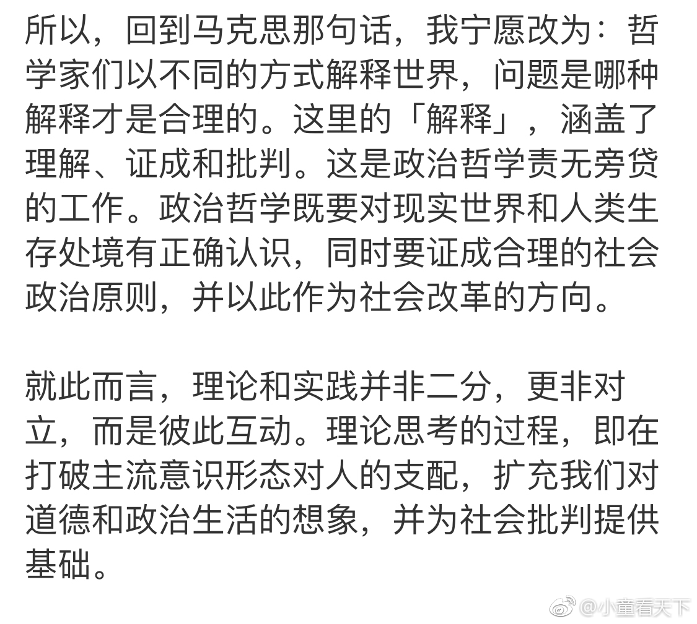

[小童看天下](http://weibo.com/1831727905)
01/22/2019

* * *

我前边已经说过，他文章中的马克思的观点与马克思无关，那是他虚构出的，因此没有批判的价值。但他对“哲学家们只是用不同的方式解释世界，而问题在于改变世界”这个命题的理解和胡乱解释，就有必要进行批判。

如果让我直接说结论，简单说就是，马克思与从前的哲学及哲学家们彻底决裂。因此这并不是不要理论，而是要能付诸于实践的理论，即科学；扬弃不能实践的理论，即哲学。因此把“问题在于改变世界”解释为不要理论是荒谬的。居然说什么“如果理论没用，那我们就不要读他的《资本论》了”是个多么可笑的理解，他是不是以为理论就是哲学？自大狂也不能自大成这样。还说什么“没有理由说自己不是哲学家”，人家恰恰就是不承认了。所以请在《关于费尔巴哈提纲》出现后的所有著作中找找看以及对哲学的评价。

就像宣布哲学死了两个人指出的：哲学是在缺乏真的情况下建立真理（海德格尔）。维特根斯坦认为哲学家是一种精神疾病的表现，必须得治。

但要去解释“哲学家们只是用不同的方式解释世界，而问题在于改变世界”涉及的理论范围很大，可以写一本专门的著作，尤其要叙述马克思的思想历程，但在微博可没这精力写。不过我也不能就写这几句就结束，让大家失望。那就简单说两句，今天累够呛。

例如他通过《林木盗窃法》发现，穷苦百姓捡枯枝烂叶居然被法律定为盗窃罪。这种捡拾自然赋予的产物的历史权利和天然权利被定为违法的法律被制定出的依据是什么？

马克思发现无论从理性构建出什么样的合理的道德、伦理、价值观念，但在现实问题面前都经不起检验。重要的是他发现，正是这种资本主义生产方式的“恶”，开辟了政治自由这一历史性的进步，为人类解放开辟了道路，他认识到“自我异化的扬弃和自我异化走的是同一条路”，因此人类只有在资本主义生产方式为基础的道路上前进。正如尼采说的：“最大的恶属于最大的善，这便是创造…一切不言而喻的真理都是有毒的。在我们的真理上所能破碎的，都让它破碎吧！”

所以在马克思看来，恰恰是、也只能是资本家的或者说人的贪欲才能开辟和实现人类的解放，因此《资本论》指出：“作为价值增殖的狂热追求者，他肆无忌惮地迫使人类去为了生产而生产，从而发展社会生产力、去创造生产的物质条件；而只有这样的条件，才能为一个更高级的、以每一个个人的全面而自由的发展为基本原则的社会形式建立现实基础。”

因此只能是对现实的历史的客观发展过程以及资本主义生产方式的各个方面进行正确的认识并做出反应。以往哲学家们对于问题的解释不仅无助于现实问题的解决，而且会成为历史发展的阻碍，导致“思维的抽象和自大总是同它的现实的片面性和低下保持同步”，而不是由每个历史阶段的经济状况所形成社会状况和人的发展同步。所以《提纲》三指出：“环境的改变和人的活动或自我改变的一致，只能被看作是并合理地理解为革命的实践。”打个比方，你不能要求一个乞丐具备国王的举止。不能要求还未摆脱贫困的乡村环境具备发达国家的环境卫生条件。

以道德判断处理问题，就会出现好和坏这种区分，就会提出消灭坏的方面的问题，所以马克思说：“谁要给自己提出消除坏的方面的问题，就是立即切断了辩证运动。”消除坏的这种问题一旦提出并实施，就会对社会发展形成阻碍，导致社会的灾难，公共秩序瓦解。

历史发展的道路不是思想活动，而是历史活动，只有通过实践才能进入真实的世界。因为“解放是由历史的关系，是由工业状况、商业状况、农业状况、交往状况促成的”，不是由哲学家们在思想中努力寻找的“幸福”答案解决的。尼采说：“古代思想家们全力寻找幸福和真理，但是人们永远找不到他必须找的东西，这是大自然的一条恶毒法则。”因为历史从来不根据人们的意识发展，而是根据现实的生产关系。无论哲学家们怎么思考，现实问题的解决都取决于现实的物质力量所形成的手段。

但是这并不是说，不去思考。而是要进行主观思维与客观规律相一致的思考方式，即始终追随实践，把现实作为唯一的立足点，让一切形而上学或脱离现实的哲学思考或是意识形态没有立足之地。比如，化学理论的内容就是实践本身的结果，不存在某个化学公式在现实中不存在的状况。但是这并不是说化学教科书中发现了所有的物质内容，而是随着科学手段的提高与实践会有更多的发展，但不存在神秘的理论。

同样，社会也是如此，所以《费尔巴哈提纲》第八条说“全部社会生活在本质上是实践的。凡是把理论引向神秘主义的神秘东西，都能在人的实践中以及对这个实践的理解中得到合理的解决。”

因此《费尔巴哈提纲》的出现，尤其是“哲学家们只是用不同的方式解释世界，而问题在于改变世界”这个命题的提出，究其根本是否定了哲学，而不是对哲学的再造或提升，这是一种新的世界观，这就像不能把佛学称为哲学一样。恩格斯说：“社会主义自从成为科学以来，就要求人们把它当作科学来对待。”但是对于很多人来说，仅从科学角度又无法充分的理解马克思，例如波普尔指出的科学的可证伪性问题。

但是即便如此，波普尔也认识到：“马克思的出现让社会学再也不能回到从前了…所有现代学者都应归功于马克思，即使他们不知道他…甚至他的错误的理论也是他的不可战胜的人道主义和正义感的证明。”波普尔这个评价对于马克思理论的价值来说一种赞美，但对于马克思主义的科学性来说，又是一种误解。因为对马克思的理论原则来说，是拒绝人本主义的，反对一切主体性哲学。如《提纲》六指出的：“人的本质并不是单个人所固有的抽象物。在其现实性上，它是一切社会关系的总和。”所以在马克思在《资本论》序言也提醒读者“这里涉及的人，只是经济范畴的人格化，是一定的阶级关系和利益的承担者”。

但是马克思主义学者重新对人的研究，例如卢卡奇的人道主义的马克思主义。形成对马克思的研究又回到一种哲学上的态度，而不是科学的研究。萨特把哲学分三阶段，笛卡尔到洛克；康德到黑格尔：马克思阶段。虽然他看到了马克思与以往哲学的界限，但并没有充分认识到马克思与哲学决裂的彻底性。所以一百年来，马克思主义的研究，都是一种扭曲的状态，有的甚至是只有马克思主义的外壳，而内容与马克思没有任何关系，按照齐泽克的话是“没有咖啡因的咖啡”。

所以用“理论和实践统一”去理解是不准确的或者说很勉强。也不是某人说的“彼此互动”，更不是“哲学家们只是用不同方式解释世界，问题在于哪种解释是更合理的”。因为理论本身就应该是实践的，而实践就应该以科学的方法进行。

我就说个大概意思吧，对付鞋底泥应该够了。

[查看源微博](http://weibo.com/1831727905/Hd9Q8Fks7)